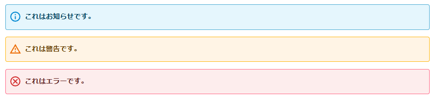

## v0.41.0

- **Markdown**: リストにネストされたテーブルが表示されるようにした
- **Markdown**: `- [ ]`のチェックボックス構文でこの文字列がそのまま出てくる問題の修正
- **Markdown**: `- [ ]`のチェックボックス構文でリストマーカーが表示される問題の修正
- **Markdown**: 通常の画像構文で`<figure>`にラップされるのをされないようにした（深い意味はない）

## [v0.40.0](https://github.com/Lycolia/adiary-extends/pull/74)

- **編集画面**: 操作に邪魔なヘルプを削除
- **編集画面**: タグ入力をインクリメンタルサーチできるように修正
- **編集画面**: 多重拡張子のアップロードを許容するように変更
- **編集画面**: 記事中の画像からサムネイルを選べるようにした
- **Markdown**: 数字リストが2桁になるとコードフェンスのネストが機能しなくなる問題を修正
- **Markdown**: \`\` foo \` bar \`\`が正しくコードスパンにならない問題の修正
- **特殊記法**: YoutubeのIDにハイフンがあると正しく出ない問題を修正
- **その他**: 記事のごみ箱と更新履歴機能を追加

## v0.30.0

- **閲覧画面**: Android EdgeでFancyboxを利用して画像を拡大しているときに、ロングタップでコンテキストメニューが出ない問題を対応し、Fancyboxを使った表示で画像を保存できるように対応

## v0.29.0

- **編集画面**: 下書きやファイル添付の行にある公開ボタンを削除。誤爆して公開されてしまうため。

## v0.28.0

- **Markdown**: `## C#`のような見出しを書くと`#`が消える問題に対応。副作用として`## header 2 ##`の構文を非対応にした

## v0.27.0

- **編集画面**: 動画ファイルを添付したときに動画タグが展開されない問題があったため、展開されるように修正した
  - ついでにvideoタグのサイズ指定がない場合にYoutube埋め込みと同じサイズで出すようにした。

## v0.26.0

- **特殊記法**: 情報・警告・エラーの三種類のバナー記法を実装
  ```
  [info:これはお知らせです。]
  [warn:これは警告です。]
  [error:これはエラーです。]
  ```
  
- **特殊記法**: 元々存在していた`warn`記法の削除。↑の記法と衝突していたため

## v0.25.0

- **閲覧画面**: 作成した記事のIDが500, 600, 700などでキリがいいときに、一つ前の記事への参照リンクが生成されない問題の修正

## v0.24.0

- **デザイン**: HTTPS->HTTPのリバースプロキシ時にOGのURIスキーマがHTTPSにならない問題を対応

## v0.23.0

- **Markdown**: `->`が含まれているときにパースが壊れる問題の対応

## v0.22.dev-1

- **編集画面**: デフォルトでアップロードを許可する拡張子にapngとwebpを追加

## v0.21.0

- **閲覧画面**: IPv6のコメントのホスト名が不正になる問題の対応（例えばOCNからなのにawsのホスト名になったりする）

## v0.16.0

- **Markdown**: 脚注書式に対応

## v0.15.0

- **その他**: RSSフィードのURLにハッシュリンクがつかないようにした
  - ブログ村で同一記事が複数登録されることがあったため

## v0.13.0

- **閲覧画面**: 投稿日と更新日を両方出せるようにした

## v0.9.2

- **Markdown**: thとtdの最終要素のスペースがトリムされず、そのまま出てくる不具合の修正
  - Prettierなどで自動整形しているMarkdownの場合、`| hoge      |`のようになるが、この後ろにあるスペースが全部HTMLのtdに出てきて、文字列を選択するときに不便だったため

## v0.9.0

- **閲覧画面**: 画像に代替テキストを設定していない場合（画像ファイル名そのままの場合）、代替テキストを出力しないようにした（alt, titleを空文字設定）
- **閲覧画面**: Lightbox2をFancybox v3.5.7に置き換えた

## v0.8.0

- **Markdown**: `[text](<https://example.com/hoge_()>)`が機能するようにした

## v0.7.0

- **Markdown**: Code spansで連続したバックスラッシュが正常に表示されるようにした

## v0.6.2

- **デザイン**: lycoテーマの追加

## v0.6.0

- **閲覧画面**: Syntax HightlightをPrism.jsにした

## v0.5.0

- **閲覧画面**: OGPのメタタグがUAによらず無条件で出力されるようにした

## v0.4.1

- **デザイン**: テンプレート変数でHTTPリファラを使えるようにした

## v0.3.0

- **閲覧画面**: テーブルが記事幅を超えた時に横スクロールできるようにした

## v0.2.0

- **編集画面**: 任意の画像をOGPに設定可能にした

## v0.1.0

- **閲覧画面**: RSSアイコンの画像を80x15ブリリアントバナーにした
- **編集画面**: クリップボードから画像をアップロードできるようにした
- **Markdown**: 2スペースインデントでリスト記法が機能するようにした
