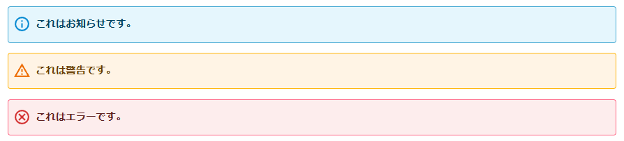

## 閲覧画面

- [v0.1.0] RSSアイコンの画像を80x15ブリリアントバナーにした
- [v0.3.0]テーブルが記事幅を超えた時に横スクロールできるようにした
- [v0.5.0] OGPのメタタグがUAによらず無条件で出力されるようにした
- [v0.6.0] Syntax HightlightをPrism.jsにした
- [v0.9.0] 画像に代替テキストを設定していない場合（画像ファイル名そのままの場合）、代替テキストを出力しないようにした（alt, titleを空文字設定）
- [v0.9.0] Lightbox2をFancybox v3.5.7に置き換えた
- [v0.13.0] 投稿日と更新日を両方出せるようにした
- [v0.21.0] IPv6のコメントのホスト名が不正になる問題の対応（例えばOCNからなのにawsのホスト名になったりする）
- [v0.25.0] 作成した記事のIDが500, 600, 700などでキリがいいときに、一つ前の記事への参照リンクが生成されない問題の修正

## 編集画面

- [v0.1.0] クリップボードから画像をアップロードできるようにした
- [v0.2.0] 任意の画像をOGPに設定可能にした

## Markdown

- [v0.1.0] Markdownで2スペースインデントでリスト記法が機能するようにした
- [v0.7.0] Code spansで連続したバックスラッシュが正常に表示されるようにした
- [v0.8.0] `[text](<https://example.com/hoge_()>)`が機能するようにした
- [v0.9.2] thとtdの最終要素がトリムされない不具合の修正
- [v0.16.0] Markdownの脚注書式に対応
- [v0.23.0] Markdown記法で`->`が含まれているときにパースが壊れる問題の対応

## 特殊記法

- [v0.26.0] 情報・警告・エラーの三種類のバナー記法を実装
  ```
  [info:これはお知らせです。]
  [warn:これは警告です。]
  [error:これはエラーです。]
  ```
  
- [v0.26.0] 元々存在していた`warn`記法の削除
  - ↑の記法と衝突していたため

## デザイン

- [v0.4.1] テンプレート変数でHTTPリファラを使えるようにした
- [v0.6.2] lycoテーマの追加
